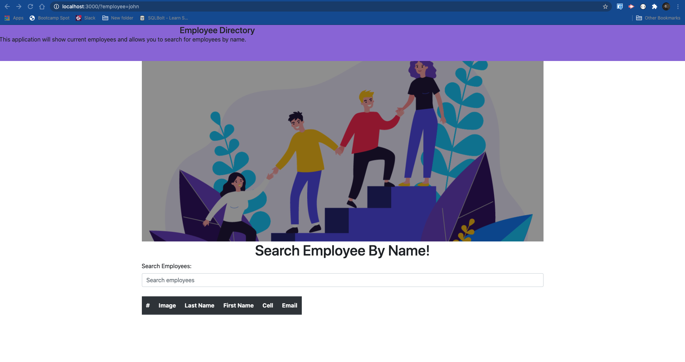

# Employee Directory Homework 19  

## Introduction  

This assignment was given to create a react website that can be used to sort through a list of employees by name. This was our introduction into react.js; so it is basic in its design.

## Table of Contents:  
* [Objectives](#Objectives)
* [Challenges](#Challenges)
* [Summary](#Summary)
* [Sites](#Sites)
* [Screenshots](#Screenshots)

## Objectives  

```md
The user will be able to view a list of employees and then be able to search by name.  

* As a user, I want to be able to view my entire employee directory at once so that I have quick access to their information.  

* As a user, I want to be able to view non-sensitive data about other employees. It would be particularly helpful to be able to filter employees by name.
```  

## Challenges  

Challenges were after hosting it to github pages, it wasnt deploying correctly and then my localhost wouldnt work. I posted a screenshot of my localhost and Jason (TA) went over it before I deployed it and it was working fine. 
I ended up deleting some JSON functions and the build so I could get the screenshot to put in this README.  You can see in past commits that I had that code there. 

## Summary  

Need to work on hosting platforms and some backend work after this bootcamp, seeing as I had a harder time with those aspects than the front end. 

## Sites

* [Link to repository on GitHub](https://github.com/killerkyle/react_employee_directory)  

* [Link to deployed GitHub Pages Website](https://killerkyle.github.io/react_employee_directory/)

## Screenshots


